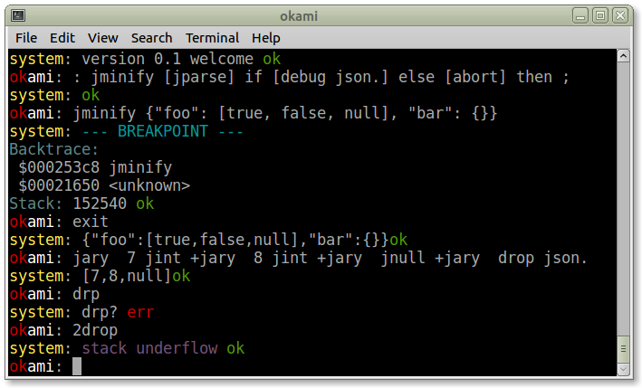

## The Threefold Conjecture

1. We need to get closer down to the level of the machine to be in control of it.

2. We need to be in control of the machine to make it collaborate with us efficiently.

3. We need to make the machine collaborate with us efficiently to create higher-quality software.

## About `okami`

`okami` is a metamodern programming language / a non-standard dialect of Forth.

The current version is written in ARM (AArch32) assembly language and runs on GNU/Linux.

The primary goal of `okami` (for now) is to answer an important question:
Are we really in such a mess that a comprehensible system can't be more than a toy?

We'll see how it goes...

All those large frameworks and libraries, those myriads of components and plugins often save as much time as they are going to cost eventually - but you never know when exactly they will blow up, so they just make development less predictable.

That's my experience.
If yours is different, fine.
In that case, there's nothing for you to see here.

## Features

No type inference,
no operator overloading,
no type checking (neither static nor dynamic),
no OOP,
no lambdas,
no local variables,
only you and the machine having an intelligent conversation to solve real problems.
:-)

## Requirements

- The CPU it runs on needs to support the division instruction.
  This is the case e.g. on a Raspberry Pi 2, but not on a Raspberry Pi 1.
- The system needs to support little-endian mode.
  Most ARMs nowadays use little-endian anyway, though.
- Setting it up requires an assembler and linker.
  For convenience, `make` and `rlwrap` (for the REPL) are recommended.

No libraries are required, not even `libc`.
The interpreter is a small statically linked binary that uses Linux syscalls directly.

## Usage

Type `make` to assemble and link the interpreter.
You might have to change the name of the assembler and linker to just `as` and `ld`.

To reduce size by stripping debugging symbols, use `make tiny`.
The resulting binary size is currently less than 6k.

Run tests with `make test` and start an interactive session with `make repl`.
The latter will require the `rlwrap` utillity.
Alternatively, you can also just do:

    $ ./okami lib/core.ok

This will read `core.ok` and enter the REPL.
Running a program can be done by adding more files to process:

    $ ./okami lib/core.ok hello.ok

To not enter the REPL afterwards, a program source can finish with `bye`.

## Tutorial

Basic knowledge of Forth is required for this section.

Code will be compiled if it is enclosed in square brackets, so a basic definition looks like this:

    : 2dup [over over];

There are no immediate words as in traditional Forth.
That means that compilation directives like control structures must be placed outside of brackets:

    : max
      [2dup >] if [drop] else [nip] then ;

You don't *need* to use square brackets, though.
`okami` uses indirect threaded code, so you could also compile a call manually by first pushing the desired code field address (CFA) onto the stack with `'` (tick) and then writing it into memory with `,` (comma):

    : sqr  ' dup ,  ' * , ;
    : cell+ ' lit , 4 , ' + , ;

Note that square brackets are *not* used to create code blocks (quotations), as in various modern concatenative languages.
They merely denote activation and deactivation of the compiler in the source text.

The equivalent of `postpone` is nesting of brackets:

    \ standard Forth code:
    : foo  postpone bar  postpone baz
           quux ; immediate
    : frob 42 foo ;
    
    \ okami equivalent:
    : foo [[bar baz] quux];
    : frob [42] foo ;

You'll have to figure the rest out from the source code for now. :-)

## Inspiration

> If it were more difficult to compose separately developed libraries
> and knock out "glue code" and if units of source beyond a certain size
> were more difficult to manage then program design might improve.
(Thomas Lord)

> The goal is to reverse the trend toward language standardization
> advocated by the users of large computer complexes.
(R. G. Loeliger)

> Are you quite sure that all those bells and whistles,
> all those wonderful facilities of your so called powerful programming languages,
> belong to the solution set rather than the problem set?
(Edsgar W. Dijkstra)

> There’s a sense in which any enhancement is also a step backward.
(Chris Cannam)

> I actually enjoy complexity that's empowering. If it challenges me,
> the complexity is very pleasant. But sometimes I must deal with
> complexity that's disempowering. The effort I invest to understand
> that complexity is tedious work. It doesn't add anything to my
> abilities.
(Ward Cunningham)

> It is time to unmask the computing community as a Secret Society
> for the Creation and Preservation of Artificial Complexity.
(Edsger W. Dijkstra)

> The main accomplishment in software engineering seems to have been
> to raise the general level of tolerance people have
> for flaky, awkward software.
(Thomas Lord)
